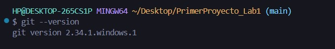
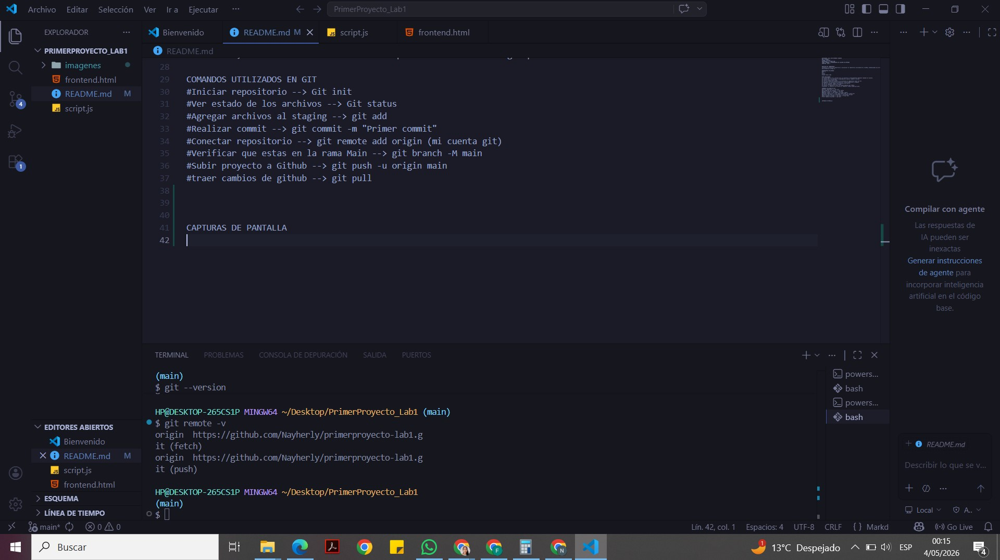
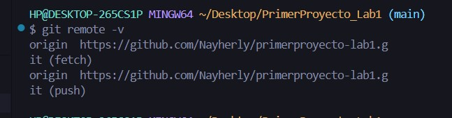
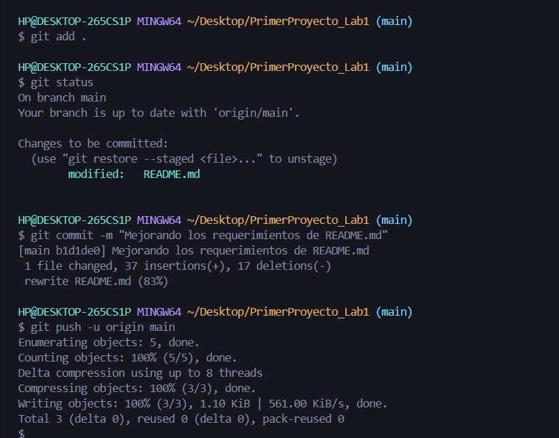

# LABORATORIO N°01 

## DESCRIPCION DEL ESTUDIANTE
- **ESTUDIANTE**: VILA CAYO NAYHERLY DIANETH 
- **DNI**: 73190834 
- **CÓDIGO**: 27202120
- **PERTENEZCO A LA SERIE 500**
- **CURSO**: PRUEBAS Y ASEGURAMIENTO DE CALIDAD DE SOFTWARE 
- **SEMESTRE**: 2026 I

----

## OBJETIVO DEL LABORATORIO:
Configurar el entorno de desarrollo e inicializar un repositorio utilizando Git y GitHub, estableciendo una estructura base para proyectos en Node.js.

## HERRAMIENTAS UTILIZADAS: 
- Node.js
- Git
- GitHub
- Visual Studio Code

## PASOS REALIZADOS: 
1. Se instaló Node.js en su versión LTS y se verificó su funcionamiento mediante comandos en consola.
2. Se instaló Git y se configuró la identidad del usuario (nombre y correo).
3. Se instaló Visual Studio Code.
4. Se creó una carpeta de proyecto y se inicializó un repositorio local con Git.
5. Se agregaron los archivos del proyecto al área de preparación (staging).
6. Se realizó el primer commit con un mensaje descriptivo.
7. Se creó un reposorio remoto en GitHub.
8. Se conectó el repositorio local con GitHub mediante git remote.
9. Finalmente, se subieron los archivos al reposorio remoto usando git push.

--- 

## COMANDOS UTILIZADOS EN GIT 
# Iniciar repositorio --> Git init
# Ver estado de los archivos --> Git status
# Agregar archivos al staging --> git add
# Realizar commit --> git commit -m "Primer commit"
# Conectar repositorio --> git remote add origin (mi cuenta git)
# Verificar que estas en la rama Main --> git branch -M main
# Subir proyecto a Github --> git push -u origin main
# traer cambios de github --> git pull 

## CAPTURAS DE PANTALLA

